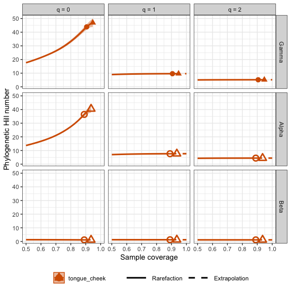

<!-- README.md is generated from README.Rmd. Please edit that file -->

`iNEXT.UniFrac` (iNterpolation and EXTrapolation for UniFrac distance)
is an R package. In this document, we provide a quick introduction
demonstrating how to run `iNEXT.UniFrac`. Detailed information about
`iNEXT.UniFrac` functions is provided in the iNEXT.UniFrac manual, also
available in [CRAN](https://cran.r-project.org/package=iNEXT.UniFrac).
An online version of
[iNEXT.UniFrac-online](http://chao.stat.nthu.edu.tw/wordpress/software_download/iNEXT.UniFrac-online/)
is also available for users without an R background.

`iNEXT.UniFrac` provides a new way to measure UniFrac distance, by
applying dissimilarity measures based on Chiu’s et al.’s multiple
assemblages decomposition (Chiu, Jost, and Chao (2014)). And we mainly
consider three measures of Hill numbers of order q: species richness
(`q = 0`), Shannon diversity (`q = 1`, the exponential of Shannon
entropy) and Simpson diversity (`q = 2`, the inverse of Simpson
concentration).

`iNEXT.UniFrac` uses the observed sample of OTU count data (called the
“reference sample”) to calculate UniFrac distance estimates and the
associated confidence intervals for coverage-based rarefaction and
extrapolation (R/E) curve.

`iNEXT.UniFrac` computes dissimilarity as UniFrac distance estimates by
doing monotonic transformation on phylogenetic beta diversity for
rarefied and extrapolated samples, based on standardized levels of
sample completeness (measured by sample coverage). This coverage-based
sampling curve plots the diversity estimates with respect to sample
coverage.

## HOW TO CITE iNEXT.UniFrac

If you publish your work based on the results from the `iNEXT.UniFrac`
package, you should make references to the following methodology paper:

- 

## SOFTWARE NEEDED TO RUN iNEXT.UniFrac IN R

- Required: [R](https://cran.r-project.org/)
- Suggested: [RStudio
  IDE](https://www.rstudio.com/products/RStudio/#Desktop)

## HOW TO RUN iNEXT.UniFrac:

The `iNEXT.UniFrac` package is available from
[CRAN](https://cran.r-project.org/package=iNEXT.UniFrac) and can be
downloaded with a standard R installation procedure or can be downloaded
from Anne Chao’s
[iNEXT.UniFrac_github](https://github.com/yayunteng/iNEXT.UniFrac) using
the following commands. For a first-time installation, an additional
visualization extension package (`ggplot2`) must be installed and
loaded.

``` r
## install iNEXT.UniFrac package from CRAN
install.packages("iNEXT.UniFrac")
## install the latest version from github
install.packages('devtools')
library(devtools)
install_github('yayunteng/iNEXT.UniFrac')
## import packages
library(iNEXT.UniFrac)
```

Here are two main functions we provide in this package :

- **iNEXTUniFrac** : Computing dissimilarity estimates as UniFrac
  distances at specified sample coverage.

- **ggiNEXTUniFrac** : Visualizing the output from the function
  `iNEXTUniFrac`

## MAIN FUNCTION: iNEXTUniFrac()

We first describe the main function `iNEXTUniFrac()` with default
arguments:

``` r
iNEXTUniFrac(data, q = c(0, 1, 2), level = NULL, nboot = 10, conf = 0.95,
             PDtree = NULL, PDreftime = NULL)
```

The arguments of this function are briefly described below, and will be
explained in more details by illustrative examples in later text. This
main function computes UniFrac distance estimates of order q at
specified sample coverage. By default of <code>level = NULL</code>, then
this function computes estimates up to one (for q = 1, 2) or up to the
coverage of double the reference sample size (for q = 0).

<table style="width:100%;">
<colgroup>
<col width="20%">
<col width="80%">
</colgroup>
<thead>
<tr class="header">
<th align="center">
Argument
</th>
<th align="left">
Description
</th>
</tr>
</thead>
<tbody>
<tr class="odd">
<td align="center">
<code>data</code>
</td>
<td align="left">
OTU count data can be input as a <code>matrix/data.frame</code> (species
by assemblages), or a list of <code>matrices/data.frames</code>, each
matrix represents species-by-assemblages abundance matrix.
</td>
</tr>
<tr class="even">
<td align="center">
<code>q</code>
</td>
<td align="left">
a numerical vector specifying the diversity orders. Default is
<code>c(0, 1, 2)</code>.
</td>
</tr>
<tr class="odd">
<td align="center">
<code>level</code>
</td>
<td align="left">
A numerical vector specifying the particular value of sample coverage
(between 0 and 1 when <code>base = “coverage”</code>). <code>level =
1</code> (<code>base = “coverage”</code>) means complete coverage (the
corresponding diversity represents asymptotic diversity). If <code>level
= NULL</code>, then this function computes UniFrac distance estimates up
to one (for <code>q = 1, 2</code>) or up to the coverage of double the
reference sample size (for <code>q = 0</code>).
</td>
</tr>
<tr class="even">
<td align="center">
<code>nboot</code>
</td>
<td align="left">
a positive integer specifying the number of bootstrap replications when
assessing sampling uncertainty and constructing confidence intervals.
Bootstrap replications are generally time consuming. Enter
<code>0</code> to skip the bootstrap procedures. Default is
<code>10</code>. Note that large bootstrap replication needs more run
time.
</td>
</tr>
<tr class="odd">
<td align="center">
<code>conf</code>
</td>
<td align="left">
a positive number \< 1 specifying the level of confidence interval.
Default is <code>0.95</code>.
</td>
</tr>
<tr class="even">
<td align="center">
<code>PDtree</code>
</td>
<td align="left">
a <code>phylo</code>, a phylogenetic tree in Newick format for all
observed species in the pooled assemblage.
</td>
</tr>
<tr class="odd">
<td align="center">
<code>PDreftime</code>
</td>
<td align="left">
a numerical value specifying reference time for PD. Default is
<code>NULL</code> (i.e., the age of the root of PDtree).
</td>
</tbody>
</table>

This function returns an `"iNEXTUniFrac"` object which can be further
used to make plots using the function `ggiNEXTUniFrac()` to be described
below.

## DATA FORMAT/INFORMATION

Data should be provided as Individual-based abundance data.

Input data for each region with several assemblages/sites include
samples species abundances in an empirical sample of n individuals
(“reference sample”). When there are N assemblages in a region, input
data consist of a list with an S by N abundance matrix; For M regions
consisting N assemblages, input data should be M lists of S by N
abundance matrix.

A data set (a microbiome sample take from tongue dorsum and buccal
mucosa) is included in `iNEXT.UniFrac` package for illustration. The
data consist a species-by-assemblages matrix with two assemblages
(tongue and cheek).For the data, the following commands display how to
compute UniFrac distance estimate at specified sample coverage.

Run the following code to view `tongue_cheek` OTU count data: (Here we
only show the first ten rows for the matrix)

``` r
data("tongue_cheek")
tongue_cheek
```

    #>              Cheek Tongue
    #> OTU_97.10006     2      0
    #> OTU_97.10025     1      0
    #> OTU_97.1008      0      2
    #> OTU_97.10090     2      0
    #> OTU_97.101       1      1
    #> OTU_97.10216     1      0
    #> OTU_97.10217     3      0
    #> OTU_97.10220     1      0
    #> OTU_97.10238     0      1
    #> OTU_97.1026      1      0

The `iNEXTUniFrac()` function returns the `"iNEXTUniFrac"` object
including two data frames for each regions:

- C (for UniFrac distance measured by Sorensen-type dissimilarity)
- U (for UniFrac distance measured by Jaccard-type dissimilarity)

## Rarefaction/Extrapolation Via Examples

Run the `iNEXTUniFrac()` function with `tongue_cheek` data to compute
UniFrac distance standardized by sample coverage. (Here we only show the
first six rows for each output data frame)

``` r
data("tongue_cheek")
data("tongue_cheek_tree")

out = iNEXTUniFrac(data = tongue_cheek, q = c(0, 1, 2), nboot = 10, 
                            PDtree = tongue_cheek_tree, PDreftime = NULL)
```

    #> Warning: UNRELIABLE VALUE: One of the 'future.apply' iterations
    #> ('future_lapply-1') unexpectedly generated random numbers without declaring so.
    #> There is a risk that those random numbers are not statistically sound and the
    #> overall results might be invalid. To fix this, specify 'future.seed=TRUE'. This
    #> ensures that proper, parallel-safe random numbers are produced via the
    #> L'Ecuyer-CMRG method. To disable this check, use 'future.seed = NULL', or set
    #> option 'future.rng.onMisuse' to "ignore".
    #> $C
    #>   Estimate Order.q      Method    SC    Size  s.e.   LCL   UCL   Region
    #> 1    0.292       0 Rarefaction 0.500 251.324 0.006 0.281 0.303 Region_1
    #> 2    0.288       0 Rarefaction 0.525 305.770 0.006 0.277 0.300 Region_1
    #> 3    0.285       0 Rarefaction 0.550 373.475 0.006 0.273 0.298 Region_1
    #> 4    0.283       0 Rarefaction 0.575 458.672 0.007 0.270 0.296 Region_1
    #> 5    0.279       0 Rarefaction 0.600 567.070 0.007 0.266 0.293 Region_1
    #> 6    0.275       0 Rarefaction 0.625 706.332 0.007 0.260 0.289 Region_1
    #>   diversity
    #> 1    meanPD
    #> 2    meanPD
    #> 3    meanPD
    #> 4    meanPD
    #> 5    meanPD
    #> 6    meanPD
    #> 
    #> $U
    #>   Estimate Order.q      Method    SC    Size  s.e.   LCL   UCL   Region
    #> 1    0.452       0 Rarefaction 0.500 251.324 0.007 0.438 0.465 Region_1
    #> 2    0.447       0 Rarefaction 0.525 305.770 0.007 0.433 0.462 Region_1
    #> 3    0.444       0 Rarefaction 0.550 373.475 0.008 0.429 0.459 Region_1
    #> 4    0.441       0 Rarefaction 0.575 458.672 0.008 0.425 0.457 Region_1
    #> 5    0.437       0 Rarefaction 0.600 567.070 0.009 0.419 0.454 Region_1
    #> 6    0.431       0 Rarefaction 0.625 706.332 0.009 0.413 0.449 Region_1
    #>   diversity
    #> 1    meanPD
    #> 2    meanPD
    #> 3    meanPD
    #> 4    meanPD
    #> 5    meanPD
    #> 6    meanPD

The output contains two data frames: `C` for Sorensen-type, `U` for
Jaccard-type. For each data frame, it includes the UniFrac distance
estimate (`Estimate`), the diversity order (`Order.q`), `Method`
(Interpolated, Observed, or Extrapolated, depending on whether the size
`m` is less than, equal to, or greater than the reference sample size),
the sample coverage estimate (`SC`), the sample size (`Size`), the
standard error from bootstrap replications (`s.e.`), the 95% lower and
upper confidence limits of diversity (`LCL`, `UCL`), and the name of
region (`Region`). These UniFrac distance estimates with confidence
intervals are used for plotting the R/E curve.

## GRAPHIC DISPLAYS: FUNCTION ggiNEXTUniFrac()

The function `ggiNEXTUniFrac()`, which extends `ggplot2` to the
`"iNEXTUniFrac"` object with default arguments, is described as follows:

``` r
ggiNEXTUniFrac(output, scale = "fixed", transp = 0.4)  
```

<table style="width:100%;">
<colgroup>
<col width="20%">
<col width="80%">
</colgroup>
<thead>
<tr class="header">
<th align="center">
Argument
</th>
<th align="left">
Description
</th>
</tr>
</thead>
<tbody>
<tr class="odd">
<td align="center">
<code>output</code>
</td>
<td align="left">
the output of <code>iNEXTUniFrac</code>.
</td>
</tr>
<tr class="even">
<td align="center">
<code>scale</code>
</td>
<td align="left">
Are scales shared across all facets (the default, <code>“fixed”</code>),
or do they vary across rows (<code>“free_x”</code>), columns
(<code>“free_y”</code>), or both rows and columns (<code>“free”</code>)?
</td>
</tr>
<tr class="odd">
<td align="center">
<code>transp</code>
</td>
<td align="left">
a value between 0 and 1 controlling transparency. <code>transp =
0</code> is completely transparent, default is <code>0.4</code>.
</td>
</tbody>
</table>

The `ggiNEXTUniFrac()` function is a wrapper around the `ggplot2`
package to create a R/E curve using a single line of code. The resulting
object is of class `"ggplot"`, so it can be manipulated using the
`ggplot2` tools.

``` r
out = iNEXTUniFrac(data = tongue_cheek, q = c(0, 1, 2), nboot = 10, 
                   PDtree = tongue_cheek_tree, PDreftime = NULL)
ggiNEXTUniFrac(out)
```

``` r
ggiNEXTUniFrac(out)
```



## References

- Chiu, C.-H., Jost, L. and Chao\*, A. (2014). Phylogenetic beta
  diversity, similarity, and differentiation measures based on Hill
  numbers. Ecological Monographs 84, 21-44.
